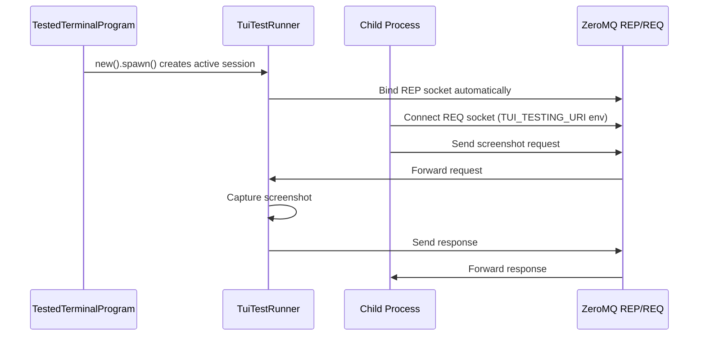

# TUI Testing Framework

A comprehensive cross-platform framework for testing terminal user interfaces. It combines the feature set of expectrl, vt100 and insta in a simple-to-use API that enables comprehensive testing of arbitrary programs.

## Overview

The TUI testing framework enables deterministic testing of terminal applications by:

- Running child processes (TUIs) in controlled environments
- Simulating user input in response to events
- Capturing screenshots at specific moments and comparing them against known good values (golden files)
- Tools for streamlined reviewing, approving and updating of the golden after changes in the implementation

## Architecture

### Components

1. **TestedTerminalProgram**: Builder for configuring and spawning terminal programs for testing
2. **TuiTestRunner**: Active test session that provides interaction methods and manages IPC
3. **TuiTestClient**: Used by child processes to request screenshot captures

### Communication Flow



## Quick Start

### Basic Usage (Tokio-style API)

```rust
use tui_testing::TestedTerminalProgram;

// Spawn a program and get an active test runner
let mut runner = TestedTerminalProgram::new("my-tui-app")
    .arg("--verbose")
    .width(120)
    .height(30)
    .screenshots("/tmp/screenshots")
    .env("MY_ENV_VAR", "value")  // Set environment variables for child process
    .spawn()
    .await?;

// Interact with the running program
runner.send("help\r").await?;
runner.read_and_parse().await?;
runner.expect("Available commands:").await?;

// Get screen contents
let screen = runner.screen_contents();

// Wait for completion
runner.wait().await?;
```

### Environment Variables

The `env()` method can be used to set environment variables that will be available to the spawned child process:

```rust
let runner = TestedTerminalProgram::new("my-app")
    .env("DEBUG", "1")  // TUI_TESTING_URI is set automatically
    .spawn()
    .await?;
```

### Advanced Screen Interaction

```rust
use tui_testing::TestedTerminalProgram;

#[tokio::test]
async fn test_interactive_tui() -> anyhow::Result<()> {
    // Create and spawn a test runner with custom screen size
    let mut runner = TestedTerminalProgram::new("my-interactive-app")
        .width(120)
        .height(30)
        .spawn()
        .await?;

    // Wait for the main menu to appear
    runner.expect("Main Menu").await?;

    // Navigate with arrow keys and enter
    runner.send("\x1b[B").await?; // Down arrow
    runner.send("\r").await?;     // Enter

    // Read and parse the updated screen
    runner.read_and_parse().await?;

    // Get the current screen state
    let screen = runner.screen();
    let cursor_pos = screen.cursor_position();

    // Check specific screen content
    let contents = runner.screen_contents();
    assert!(contents.contains("Selected Item"));

    // Wait for completion
    runner.wait().await?;

    Ok(())
}
```

## API Reference

### TestedTerminalProgram Methods

#### Constructors

- `new(program: impl Into<String>) -> Self` - Create a builder for the specified program

#### Configuration

- `arg(arg: impl Into<String>) -> Self` - Add a command-line argument
- `args<I, S>(args: I) -> Self` - Add multiple command-line arguments where I: IntoIterator<Item = S>, S: Into<String>
- `width(width: u16) -> Self` - Set terminal width in characters (default: 80)
- `height(height: u16) -> Self` - Set terminal height in characters (default: 24)
- `screenshots(dir: impl Into<PathBuf>) -> Self` - Set screenshot directory (default: temp directory)
- `env(key: impl Into<String>, value: impl Into<String>) -> Self` - Set an environment variable for the child process
- `envs<I, K, V>(vars: I) -> Self` - Set multiple environment variables where I: IntoIterator<Item = (K, V)>
- `stdout(cfg: Stdio) -> Self` - Configure stdout handling (default: inherit)
- `stderr(cfg: Stdio) -> Self` - Configure stderr handling (default: inherit)
- `stdin(cfg: Stdio) -> Self` - Configure stdin handling (default: inherit)

#### Execution

- `spawn() -> impl Future<Output = Result<TuiTestRunner>>` - Spawn the program and return an active test runner
- `status() -> impl Future<Output = Result<ExitStatus>>` - Execute and return exit status
- `output() -> impl Future<Output = Result<Output>>` - Execute and capture output

### TuiTestRunner Methods

#### Interaction

- `send(s: &str) -> impl Future<Output = Result<()>>` - Send a string to the spawned program
- `send_control(c: char) -> impl Future<Output = Result<()>>` - Send a control character
- `expect(pattern: &str) -> impl Future<Output = Result<()>>` - Wait for a pattern in output
- `read_and_parse() -> impl Future<Output = Result<usize>>` - Read output and feed to vt100 parser
- `wait() -> impl Future<Output = Result<()>>` - Wait for the spawned process to complete

#### Screen Access

- `screen_contents() -> String` - Get current screen as formatted text
- `screen() -> &vt100::Screen` - Get raw screen access
- `endpoint_uri() -> &str` - Get ZMQ endpoint for screenshot IPC
- `screenshot_dir() -> &PathBuf` - Get screenshot directory path
- `get_screenshots() -> impl Future<Output = HashMap<String, String>>` - Get captured screenshots

### TuiTestClient Methods

#### Connection

- `connect(uri: &str) -> impl Future<Output = Result<Self>>` - Connect to test runner

#### Screenshot and Control Requests

- `request_screenshot(label: &str) -> impl Future<Output = Result<()>>` - Request a screenshot
- `request_exit(exit_code: i32) -> impl Future<Output = Result<()>>` - Request program termination
- `ping() -> impl Future<Output = Result<()>>` - Test connectivity

### CLI Tools

#### tui-testing-cmd

```bash
tui-testing-cmd --uri <URI> --cmd "screenshot:<LABEL>" [--timeout <SECONDS>]
tui-testing-cmd --uri <URI> --cmd "exit:<EXIT_CODE>" [--timeout <SECONDS>]
```

#### test-guest

```bash
test-guest --uri <URI> --method <METHOD> --labels <LABELS> [--delay-ms <MILLIS>]
```

### Child Process Integration

```rust
use tui_testing::TuiTestClient;

#[tokio::main]
async fn main() -> anyhow::Result<()> {
    // Parse --tui-testing-uri argument
    let testing_uri = std::env::args()
        .find(|arg| arg.starts_with("--tui-testing-uri="))
        .map(|arg| arg.split('=').nth(1).unwrap().to_string());

    if let Some(uri) = testing_uri {
        let client = TuiTestClient::connect(&uri).await?;

        // Your TUI logic here...

        // Capture screenshot at key moment
        client.request_screenshot("main_menu").await?;
    }

    Ok(())
}
```

## Protocol Specification

### Messages

All messages are JSON-encoded and sent over ZeroMQ REQ/REP sockets.

#### Screenshot Request

```json
{
  "command": "screenshot",
  "label": "screenshot_name",
  "metadata": {
    "width": 80,
    "height": 24,
    "cursor_visible": true,
    "cursor_position": [10, 5]
  }
}
```

#### Screenshot Response

```json
{
  "status": "ok",
  "message": "Screenshot 'screenshot_name' captured successfully"
}
```

#### Ping Request

```json
{
  "command": "ping"
}
```

#### Ping Response

```json
{
  "status": "pong",
  "message": "Pong"
}
```

### Error Handling

```json
{
  "status": "error",
  "error": "Detailed error message"
}
```

## Integration Examples

### With Mock Agent

```bash
# Run agent with TUI testing enabled
ah agent start \
  --agent mock \
  --agent-flags="--tui-testing-uri=tcp://127.0.0.1:5555"
```

### With Scenario-Based Testing

```rust
use tui_testing::TestedTerminalProgram;

#[tokio::test]
async fn test_scenario_execution() -> anyhow::Result<()> {
    let mut runner = TestedTerminalProgram::new("ah")
        .args(["agent", "start", "--agent", "mock"])
        .spawn()
        .await?;

    // Child process will automatically request screenshots
    // based on scenario events via TUI_TESTING_URI environment

    runner.wait().await?;

    // Verify expected screenshots
    let screenshots = runner.get_screenshots().await;
    assert!(screenshots.contains_key("task_started"));
    assert!(screenshots.contains_key("task_completed"));
}
```

## Command-Line Client

The crate includes a command-line client `tui-testing-cmd` for sending commands to a running test server:

### Supported Commands

- **screenshot:<label>**: Request a screenshot capture with the specified label
- **exit:<exit-code>**: Terminate the tested program and assume it has produced the specified exit code

### Usage Examples

```bash
# Request a screenshot
tui-testing-cmd --uri tcp://127.0.0.1:5555 --cmd "screenshot:my_screenshot"

# Terminate the tested program with exit code 0
tui-testing-cmd --uri tcp://127.0.0.1:5555 --cmd "exit:0"

# Terminate with custom timeout
tui-testing-cmd --uri tcp://127.0.0.1:5555 --cmd "screenshot:help_screen" --timeout 10
```

This is useful for:

- Manual testing during development
- Integration with scripts and CI/CD pipelines
- Debugging TUI test setups
- Testing with subprocess execution from other languages (Python, shell scripts, etc.)
- Automating test completion and exit handling

## Advanced Features

### Screenshot Metadata

```rust
use tui_testing::TuiTestClient;

// In child processes, TUI_TESTING_URI is automatically set
let uri = std::env::var("TUI_TESTING_URI")
    .unwrap_or_else(|_| "tcp://127.0.0.1:5555".to_string());
let mut client = TuiTestClient::connect(&uri).await?;
client.request_screenshot("custom_view").await?;
```

### Golden File Testing

The framework integrates with [insta](https://insta.rs/) for golden file testing of screenshots. Golden files are stored in the `__goldens__` directory and can be managed using the provided just commands.

#### Basic Golden File Testing

```rust
use tui_testing::{TestedTerminalProgram, TuiTestClient};

#[tokio::test]
async fn test_with_golden_files() -> anyhow::Result<()> {
    let mut runner = TestedTerminalProgram::new("my-tui-app")
        .spawn()
        .await?;

    // Send commands and interact
    runner.send("help\r").await?;
    runner.expect("Available commands:").await?;

    // Request screenshot from child process
    // (In real usage, child would call TuiTestClient::connect() automatically)
    let mut client = TuiTestClient::connect(runner.endpoint_uri()).await?;
    client.request_screenshot("help_screen").await?;

    runner.send_control('c').await?;
    runner.wait().await?;

    // Use insta for golden file testing
    let screenshots = runner.get_screenshots().await;
    insta::assert_snapshot!("help_screen", screenshots["help_screen"]);

    Ok(())
}
```

#### Managing Golden Files

Use the following just commands to manage golden files:

- `just insta-accept` - Accept all pending snapshot changes
- `just insta-review` - Interactively review and accept/reject changes
- `just insta-reject` - Reject all pending snapshot changes
- `just insta-test` - Run all tests with snapshot checking
- `just insta-pending` - Show all pending snapshots
- `just insta-check` - Check if snapshots are up to date

For package-specific commands:

- `just insta-test-pkg tui-testing` - Test snapshots for the tui-testing crate
- `just insta-accept-pkg tui-testing` - Accept snapshots for the tui-testing crate

## Configuration

### Environment Variables

- `TUI_TESTING_URI`: ZeroMQ endpoint URI for child processes
- `TUI_SCREENSHOTS_DIR`: Directory for storing screenshots (defaults to temp dir)

### Command Line Options

Child processes should support:

- `--tui-testing-uri <URI>`: Enable TUI testing with specified ZeroMQ endpoint
- `--tui-testing-timeout <MS>`: Timeout for IPC operations (default: 5000ms)

## Best Practices

### Test Organization

1. **Isolation**: Each test should use a separate `TestedTerminalProgram` instance
2. **Timeouts**: Set reasonable timeouts for child process operations
3. **Cleanup**: Ensure child processes are properly terminated
4. **Determinism**: Use fixed seeds for any random operations in tests

### Screenshot Timing

1. **Stable State**: Only request screenshots when the UI is in a stable state
2. **Key Moments**: Capture at important transitions (initial load, user input, completion)
3. **Metadata**: Include relevant terminal state information with screenshots

### Error Handling

1. **Graceful Degradation**: Child processes should work normally when testing is disabled
2. **Timeout Handling**: Implement proper timeouts for IPC operations
3. **Connection Errors**: Handle ZeroMQ connection failures gracefully

## Troubleshooting

### Common Issues

1. **Port Conflicts**: Use random ports or configure specific endpoints
2. **Timeout Errors**: Increase timeouts for complex UI operations
3. **Screenshot Failures**: Ensure child process has reached stable state before capture

### Debugging

Enable tracing for detailed logs:

```rust
use tracing_subscriber;
tracing_subscriber::fmt().init();
```

## Contributing

When adding new features:

1. Update protocol definitions in `protocol.rs`
2. Add corresponding client and runner methods
3. Update documentation and examples
4. Add comprehensive tests

## License

MIT OR Apache-2.0
